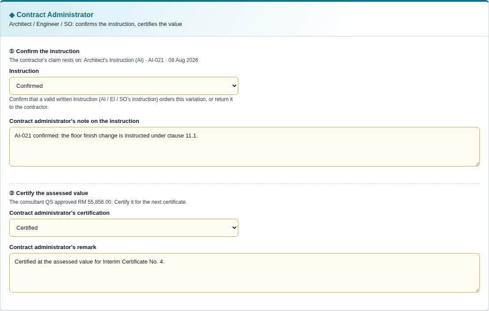
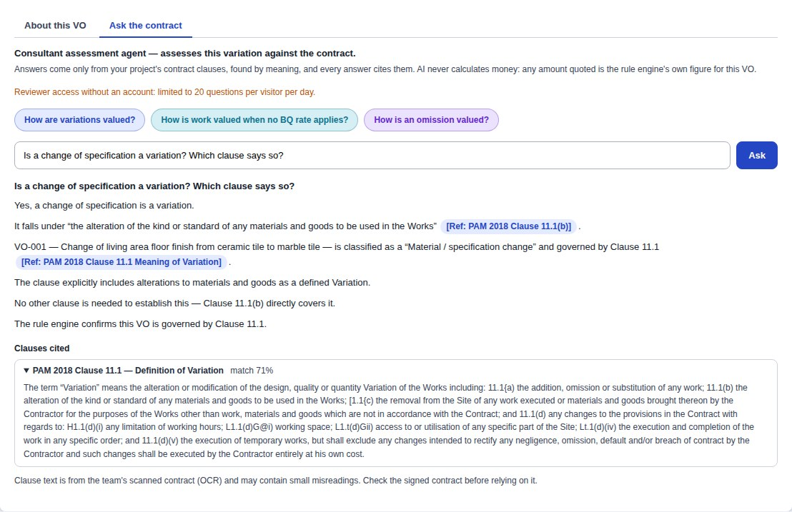
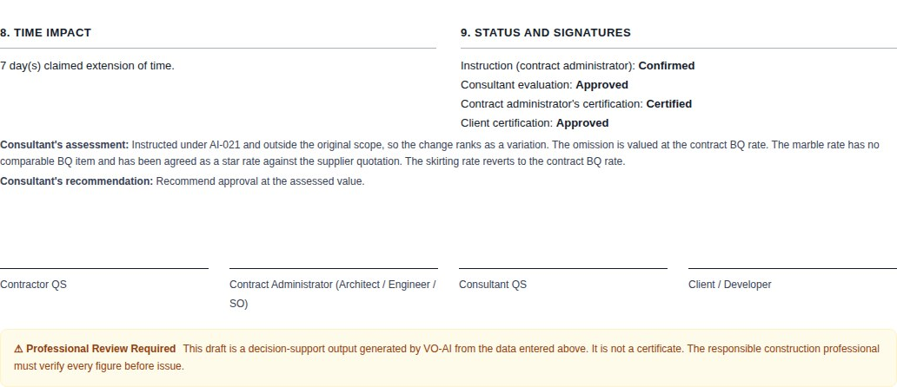

# 3. Demo Examples

## 3.1 Access Method

### Project access link

**https://cytang1107.github.io/VO-AI/**

Source code: **https://github.com/CYtang1107/VO-AI**

Open the link in any modern browser, on a computer or a phone; nothing needs installing. The
interface is available in **English and 中文** — the toggle is on the sign-in screen and in the
sidebar.

### Option 1 — One-click access for judges (recommended)

On the sign-in screen, click **「评审一键体验 →」**. It opens the demonstration project,
**Cadangan Pembangunan ABC Residence**, as the Consultant QS — no account and no password. The
project holds a priced Bills of Quantities, three variation orders at different stages, a site
map with site photos, and the PAM 2018 contract knowledge base, and 「问合同」 (Ask the contract)
works in it straight away (20 questions per visitor per day, to protect the AI quota).

In this mode the data is kept in the judge's own browser and may be changed freely; the
**Restore demo data** control on the Projects screen resets it. To see another role, use
**Switch role / sign out** in the sidebar and choose a different role on the
**Demo (no sign-in)** tab.

### Option 2 — Demonstration accounts (multi-user collaboration)

On the **Team account** tab, sign in with one of these accounts (passwords are supplied with the
submission, not published here). They are members of the same cloud project: a variation
submitted or assessed in one account appears in the others in real time.

| Role | Account | What this role does |
|---|---|---|
| Contractor QS | `contractor@vo-ai.demo` | Raises variations, photographs the site, enters measurement, attaches drawings, submits |
| Contract Administrator (Architect / Engineer / SO) | `administrator@vo-ai.demo` | Confirms the instruction or returns it; certifies the consultant's assessed value |
| Consultant QS | `consultant@vo-ai.demo` | Creates projects, imports the contract and priced BQ, assesses variations, manages members |
| Client / Developer | `client@vo-ai.demo` | Reviews the recommendation, confirms the final value, tracks all variations |

Anyone may also register their own account. A new account sees no project until a consultant
adds it — which is how the system keeps project data private.

### Getting started in four steps

1. Open the link and click **「评审一键体验 →」**.
2. On the Dashboard, look at what is waiting, the contractual deadlines and the site map.
3. Use the sidebar to move between the Dashboard, VO Register, Documents, AI Analysis and VO
   Reports.
4. Open any variation and switch to the **「问合同」** tab to ask the contract a question and
   read the cited clauses.

To try the BQ import, a sample priced BQ in the shape a real one takes — title rows, bill
headings, subtotals — is in the source code at `demo-files/sample-priced-bq.csv`.

### Three test questions

These can be answered directly in the live system, and each demonstrates a different capability.

**Question 1 — "The contractor has claimed RM 31.00 per metre for skirting. Is that correct?"**

Open **VO-001** and look at the measurement table. The system compares the claim against the
priced contract BQ and reports that contract item B/4.2 is priced at RM 22.00 per metre, that
the contract BQ rate governs, and that the claimed rate is overstated by RM 9.00 — 40.9%. Across
168 metres that is RM 1,512.00 on one line of one variation.

**Question 2 — "The architect has instructed a change from a block wall to a brick wall. What
else needs measuring?"**

Open **AI Analysis** and enter that description, choose **B/5.1** as the original item being
changed, and enter the revised item ("Brick wall"), a quantity and a rate, then click
**Analyse**. The system identifies the affected element as the Wall and asks you to confirm
whether the wall finishes, the damp-proof course and the skirting also require remeasurement,
explaining why — and that the exposed new surface will need repainting. It does not assert
that they changed — it prompts the surveyor to check, which is what a decision support system
should do.

**Question 3 — "Is a change of specification a variation? Which clause says so?"**

Open **VO-001**, switch to the **「问合同」** tab and ask the question (in English or Chinese).
The system retrieves the relevant passages of PAM 2018 and answers that a change of
specification is a variation, citing **PAM 2018 Clause 11.1** (the alteration of the kind or
standard of any materials or goods); the cited clause text and its similarity score open
beneath the answer. Follow with "How is varied work valued?" and it cites the valuation rules of
**Clause 11.6**. Ask something the contract does not cover and it says it found no relevant
clause, rather than answering from general knowledge.

---

## 3.2 Case Demonstration

The demonstration follows the worked example from Section 1.2: **a client instructs a change of
living-area floor finish from ceramic tile to marble tile.** It is carried through all four
roles, exactly as it would proceed on a project.

> **Note for the team:** the screenshots below are in `docs/screenshots/` (a `-zh` set for the
> Chinese proposal), captured at 1440px width from the current version with the seeded
> demonstration data (retake them with
> `tools/make-screenshots.js`). Each is also described, so the text stands on its own.

---

### Step 1 — Sign in and select a role

**[Screenshot 1: the sign-in screen with 「评审一键体验」 and the four role cards — retake]**

A judge clicks 「评审一键体验」; a project team signs in with their own accounts. The role
determines what each person may edit; the project membership determines what they may see. The
language toggle is available before sign-in.

---

### Step 2 — The consultant sets up the project

**[Screenshot 2: the create-project panel with the BQ import]**

The Consultant QS creates the project and uploads the priced Bills of Quantities. The system
reads the file — CSV or XLSX — and determines which column holds the code, description, unit
and rate, stating why it reached each conclusion. It previews the items it will import and
reports the rows it skipped, such as header rows, section headings and subtotals. Nothing is
imported until the user confirms, because these rates become the benchmark against which every
subsequent claim is checked.

---

### Step 3 — The contractor raises the variation

**[Screenshot 3: VO detail, the contractor's panel, showing the instruction and the attached
documents]**

The contractor records the instruction — Architect's Instruction AI-021 — describes the change,
and enters the measurement: omit 320 m² of ceramic tiling, add 320 m² of marble, and 168 m of
skirting to match. The revised and superseded drawings (A-201 Rev C and Rev B), the marble
supplier's quotation, GPS-tagged site photos (shown as pins on the site map) and the contract
the variation is assessed against are attached, each kept with its revision history. Every document opens with a click — the
demonstration project carries sample files for all of them. The contractor
submits, which starts the consultant's 30-day evaluation period.

---

### Step 3a — The contract administrator confirms the instruction

**[Screenshot 3b: the contract administrator's panel — instruction confirmation and certification]**

The submission goes first to the Contract Administrator — the Architect, Engineer or SO. They
check that a valid written instruction (here AI-021) orders the change, and either confirm it or
return it to the contractor with a note. Until the instruction is confirmed, the consultant's
assessment panel stays locked and says why.

---

### Step 4 — The rate cross-check

**[Screenshot 4: the measurement table showing all three rate verdicts — this is the central
image of the demonstration]**

This is the system's core function. Each claimed rate is compared against the priced contract
BQ:

| Item | Claimed | Contract BQ | Verdict |
|---|---|---|---|
| Omit ceramic floor tiles, 320 m² | RM 85.00/m² | RM 85.00/m² (B/4.1) | **Same rate** — valued at the contract rate |
| Add marble floor tiles, 320 m² | RM 265.00/m² | No comparable item | **Star rate** — must be agreed separately, supported by a quotation |
| Skirting to match, 168 m | RM 31.00/m | RM 22.00/m (B/4.2) | **Different rate** — contract BQ rate governs; claim overstated by RM 9.00 (40.9%) |

The system identifies the comparable BQ item itself and explains how it matched. The contractor
has claimed **RM 62,808.00**.

---

### Step 5 — The consultant assesses

**[Screenshot 5: the assessment panel showing the governing clause, findings and variance]**

The consultant reviews the classification — a material and specification change affecting
Finishes — and the governing clause, PAM 2018 Clause 11.1, with the entitlement and the
evidence required. The findings state which rows need correction and why. Asked in 「问合同」
how varied work is valued, the agent answers from PAM 2018 Clause 11.6 and cites it.

**[Screenshot 9: 「问合同」 answering from PAM 2018 Clause 11.1, the cited clause opened beneath]**

The consultant applies the contract rate to the skirting, agrees a star rate of RM 248.00/m² for
the marble against the supplier quotation — which opens from the variation's supporting
documents and shows the build-up, RM 190.00 supply plus RM 58.00 laying — and records a time
impact of 7 days. The assessed
value is **RM 55,856.00** — a reduction of **RM 6,952.00** that the system identified and
evidenced, and that a manual check could easily have missed.

---

### Step 6 — The contract administrator certifies; the client confirms

**[Screenshot 6: the client's view of the same variation, with the certification fields now
editable]**

Once the consultant approves the assessment, the Contract Administrator certifies the assessed
value. The client then sees the same facts presented for a decision: what changed, why it is
contractually a variation, the claimed and assessed values, and the time impact. Their own panel
holds only the confirmation fields — locked until the contract administrator certified, and now
editable. The contractor's
and consultant's columns are a click away, read-only, under "Show the other roles' columns". The
client certifies at the assessed value.

---

### Step 7 — The draft variation order report

**[Screenshot 7: the printed report showing the section order and the rate verdicts]**

The system assembles a draft report in the order a submission requires: instruction,
classification and affected elements, contractual basis (with the contract relied on), revised
drawing, superseded drawing,
measurement and valuation, supporting documents, findings, time impact, and status with
signature blocks for all four parties. Each role receives a report weighted to its needs, all
rendered from the same record so they cannot disagree.

The report prints to PDF directly from the browser. It carries the professional review notice
and is labelled a draft — it is never presented as a certificate, and a variation that has not
been certified shows no certified value.

---

### Step 8 — Tracking

**[Screenshot 8: the dashboard showing outstanding deadlines, and the all-variations summary]**

The dashboard shows each role what is waiting on them and the contractual periods running
against it; a period that is overdue or due within seven days is flagged. The summary report totals every variation on the project — claimed,
assessed and certified — against the contract sum, which is a client's first question about
variations.

---

### What the demonstration shows

Every figure in this walkthrough was computed from data entered during it. No confidence score
is displayed, because nothing in the system produces one. No clause is cited that is not in the
knowledge base — the server checks every citation in a 「问合同」 answer against the clauses it
retrieved, and refuses any amount the rule engine did not produce. Where the system cannot classify a change, it says so and asks for a clearer
description.

The RM 6,952.00 difference between the claim and the assessment was found by comparing rates
against the contract — a control a quantity surveyor performs by hand today, on every line of
every variation.
