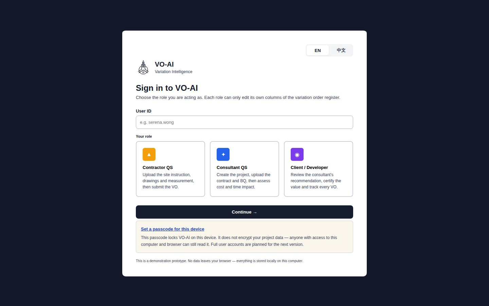
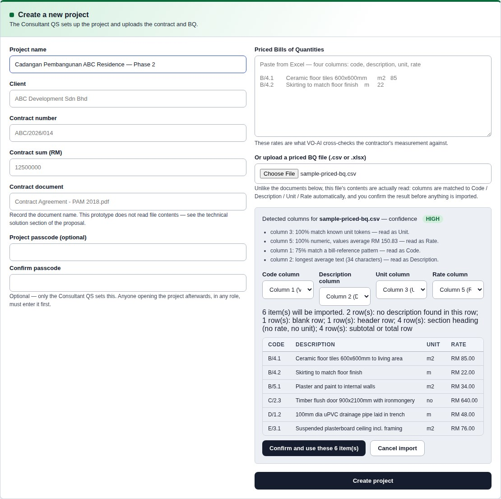
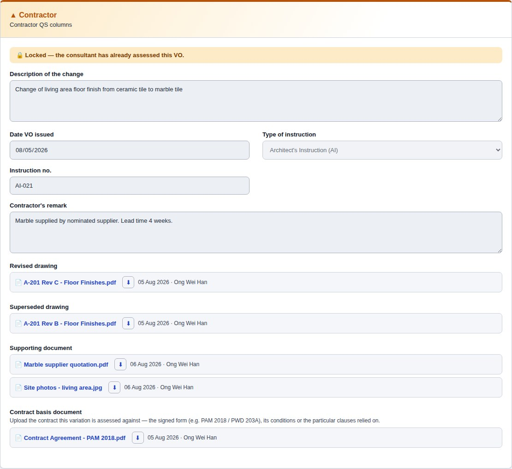
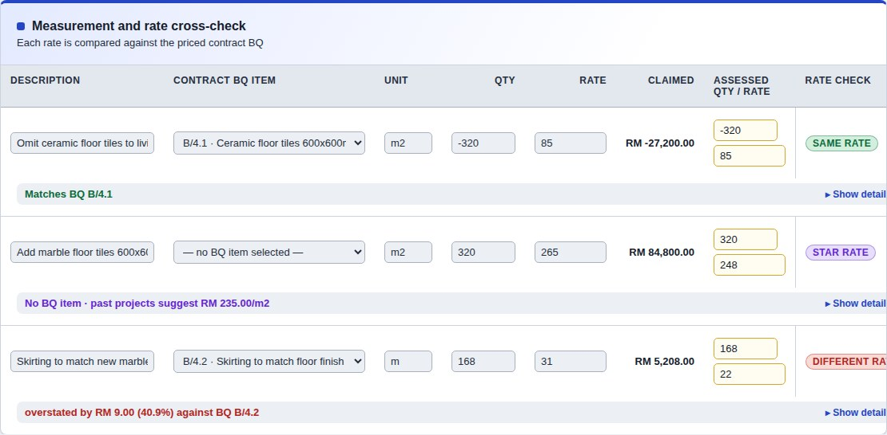
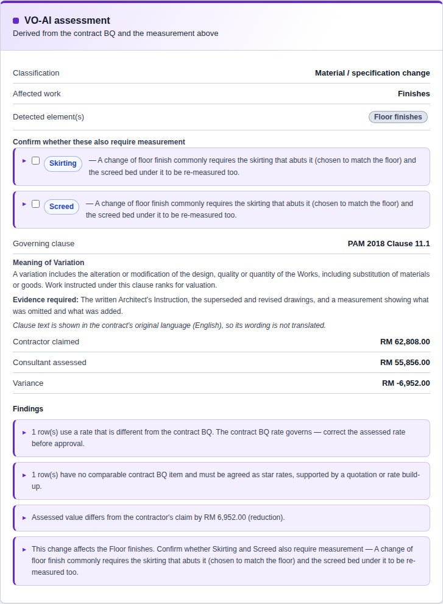
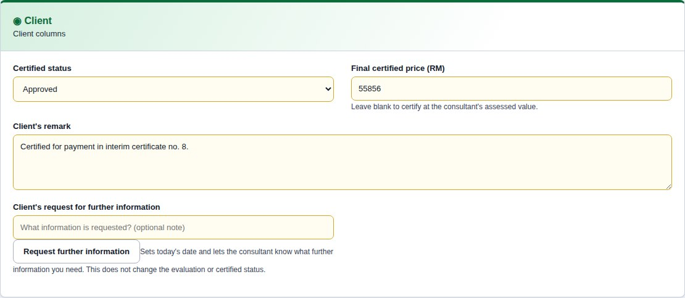
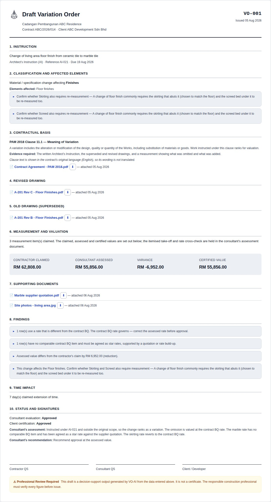
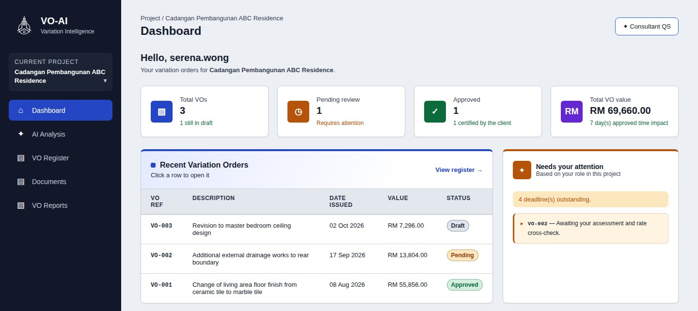
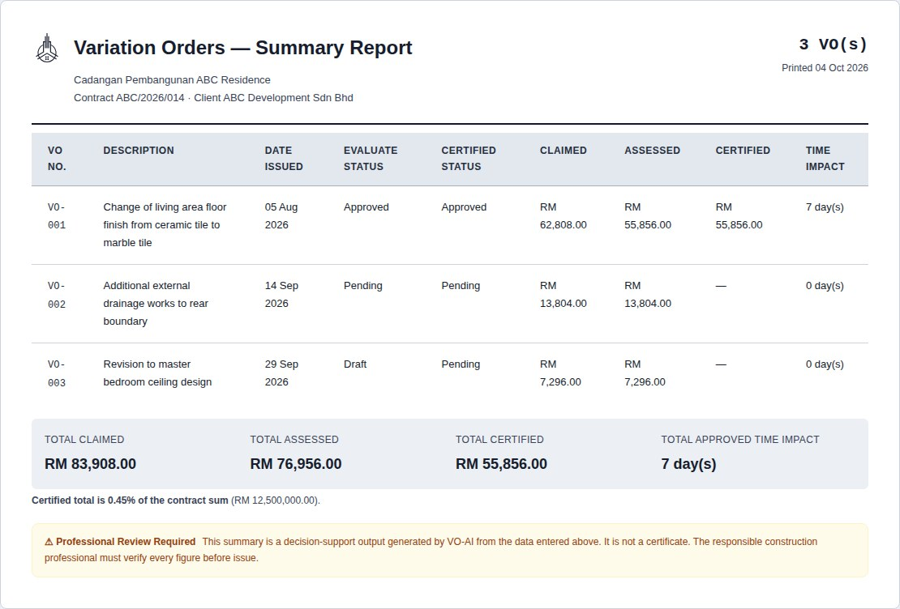

# 3. Demo Examples

## 3.1 Access Method

### Project access link

**https://cytang1107.github.io/VO-AI/**

Source code: **https://github.com/CYtang1107/VO-AI**

### No login credentials required

VO-AI does not require an account, a password or an installation. Open the link in any modern
browser — on a computer or a phone — and the system is immediately usable. This is deliberate:
the application holds no data outside your own browser, so there is nothing for an account to
protect and no reason to place a barrier in front of a first-time user.

At the sign-in screen you enter a **user ID** of your choosing and select the **role** you wish
to act as. To see the system as it is intended to be used, we suggest these three:

| Role | Suggested user ID | What this role does |
|---|---|---|
| Consultant QS | `serena.wong` | Creates projects, uploads the contract and priced BQ, assesses variations, approves or rejects |
| Contractor QS | `ong.weihan` | Raises variations, enters measurement, attaches drawings, submits |
| Client / Developer | `tan.ziqian` | Reviews the recommendation, certifies the value, tracks all variations |

The interface is available in **English and 中文** — the toggle is on the sign-in screen and in
the sidebar.

### Getting started in four steps

1. Open the link. Enter a user ID, choose **Consultant QS**, and continue.
2. Open the seeded demonstration project, **Cadangan Pembangunan ABC Residence**. It contains a
   priced Bills of Quantities and three variation orders at different stages.
3. Use the sidebar to move between the Dashboard, VO Register, Documents, AI Analysis and VO
   Reports.
4. To see the role-based behaviour, use **Switch role / sign out** and sign back in as a
   different role. The same project will look different, and different fields will be editable.

If you wish to return to the original demonstration data at any point, the **Restore demo data**
control on the Projects screen resets everything. To try the BQ import, a sample priced BQ in
the shape a real one takes — title rows, bill headings, subtotals — is in the source code at
`demo-files/sample-priced-bq.csv`.

### Three test questions

These can be answered directly in the live system, and each demonstrates a different capability.

**Question 1 — "The contractor has claimed RM 31.00 per metre for skirting. Is that correct?"**

Sign in as Consultant QS, open the project, open **VO-001** and look at the measurement table.
The system compares the claim against the priced contract BQ and reports that contract item
B/4.2 is priced at RM 22.00 per metre, that the contract BQ rate governs, and that the claimed
rate is overstated by RM 9.00 — 40.9%. Across 168 metres that is RM 1,512.00 on one line of one
variation.

**Question 2 — "The architect has instructed a change from a block wall to a brick wall. What
else needs measuring?"**

Open **AI Analysis** and enter that description, choose **B/5.1** as the original item being
changed, and enter the revised item ("Brick wall"), a quantity and a rate, then click
**Analyse**. The system identifies the affected element as the Wall and asks you to confirm
whether the wall finishes, the damp-proof course and the skirting also require remeasurement,
explaining why — and that the exposed new surface will need repainting. It does
not assert that they changed — it prompts the surveyor to check, which is what a decision
support system should do.

**Question 3 — "Which contract clause governs a change of specification, and what must the
contractor prove?"**

Open any variation, or run an analysis, and read the contractual basis. The system returns PAM
2018 Clause 11.1, the entitlement it creates, and the evidence required — the written
instruction, the superseded and revised drawings, and a measurement showing what was omitted
and what was added. Where a description is too vague to classify, the system says so and asks
for more detail rather than offering a clause it cannot support.

---

## 3.2 Case Demonstration

The demonstration follows the worked example from Section 1.2: **a client instructs a change of
living-area floor finish from ceramic tile to marble tile.** It is carried through all three
roles, exactly as it would proceed on a project.

> **Note for the team:** the screenshots below are in `docs/screenshots/`, captured at 1440px
> width from the current version with the seeded demonstration data (retake them with
> `tools/make-screenshots.js`). Each is also described, so the text stands on its own.

---

### Step 1 — Sign in and select a role

**[Screenshot 1: the sign-in screen showing the three role cards]**

The user enters a user ID and chooses the role they are acting as. There is no password
barrier — the role determines what they may edit, not what they may see. The language toggle is
available before sign-in.

---

### Step 2 — The consultant sets up the project

**[Screenshot 2: the create-project panel with the BQ import]**

The Consultant QS creates the project and uploads the priced Bills of Quantities. The system
reads the file — CSV or XLSX — and determines which column holds the code, description, unit
and rate, stating why it reached each conclusion. It previews the items it will import and
reports the rows it skipped, such as header rows, section headings and subtotals. Nothing is
imported until the user confirms, because these rates become the benchmark against which every
subsequent claim is checked.

---

### Step 3 — The contractor raises the variation

**[Screenshot 3: VO detail, the contractor's panel, showing the instruction and the attached
documents]**

The contractor records the instruction — Architect's Instruction AI-021 — describes the change,
and enters the measurement: omit 320 m² of ceramic tiling, add 320 m² of marble, and 168 m of
skirting to match. The revised and superseded drawings (A-201 Rev C and Rev B), the marble
supplier's quotation, a site photo and the contract the variation is assessed against are
attached, each kept with its revision history. Every document opens with a click, or downloads
with ⬇ — the demonstration project carries sample files for all of them. The contractor
submits, which starts the consultant's 30-day evaluation period.

---

### Step 4 — The rate cross-check

**[Screenshot 4: the measurement table showing all three rate verdicts — this is the central
image of the demonstration]**

This is the system's core function. Each claimed rate is compared against the priced contract
BQ:

| Item | Claimed | Contract BQ | Verdict |
|---|---|---|---|
| Omit ceramic floor tiles, 320 m² | RM 85.00/m² | RM 85.00/m² (B/4.1) | **Same rate** — valued at the contract rate |
| Add marble floor tiles, 320 m² | RM 265.00/m² | No comparable item | **Star rate** — must be agreed separately, supported by a quotation |
| Skirting to match, 168 m | RM 31.00/m | RM 22.00/m (B/4.2) | **Different rate** — contract BQ rate governs; claim overstated by RM 9.00 (40.9%) |

The system identifies the comparable BQ item itself and explains how it matched. The contractor
has claimed **RM 62,808.00**.

---

### Step 5 — The consultant assesses

**[Screenshot 5: the assessment panel showing the governing clause, findings and variance]**

The consultant reviews the classification — a material and specification change affecting
Finishes — and the governing clause, PAM 2018 Clause 11.1, with the entitlement and the
evidence required. The findings state which rows need correction and why.

The consultant applies the contract rate to the skirting, agrees a star rate of RM 248.00/m² for
the marble against the supplier quotation — which opens from the variation's supporting
documents and shows the build-up, RM 190.00 supply plus RM 58.00 laying — and records a time
impact of 7 days. The assessed
value is **RM 55,856.00** — a reduction of **RM 6,952.00** that the system identified and
evidenced, and that a manual check could easily have missed.

---

### Step 6 — The client certifies

**[Screenshot 6: the client's view of the same variation, with the certification fields now
editable]**

The client sees the same facts presented for a decision: what changed, why it is contractually a
variation, the claimed and assessed values, and the time impact. Their own panel holds only the
certification fields — locked until the consultant approved, and now editable. The contractor's
and consultant's columns are a click away, read-only, under "Show the other roles' columns". The
client certifies at the assessed value.

---

### Step 7 — The draft variation order report

**[Screenshot 7: the printed report showing the section order and the rate verdicts]**

The system assembles a draft report in the order a submission requires: instruction,
classification and affected elements, contractual basis (with the contract relied on), revised
drawing, superseded drawing,
measurement and valuation, supporting documents, findings, time impact, and status with
signature blocks for all three parties. Each role receives a report weighted to its needs, all
rendered from the same record so they cannot disagree.

The report prints to PDF directly from the browser. It carries the professional review notice
and is labelled a draft — it is never presented as a certificate, and a variation that has not
been certified shows no certified value.

---

### Step 8 — Tracking

**[Screenshot 8: the dashboard showing outstanding deadlines, and the all-variations summary]**

The dashboard shows each role what is waiting on them and the contractual periods running
against it; a period that is overdue or due within seven days is flagged. The summary report totals every variation on the project — claimed,
assessed and certified — against the contract sum, which is a client's first question about
variations.

---

### What the demonstration shows

Every figure in this walkthrough was computed from data entered during it. No confidence score
is displayed, because nothing in the system produces one. No clause is cited that is not in the
knowledge base. Where the system cannot classify a change, it says so and asks for a clearer
description.

The RM 6,952.00 difference between the claim and the assessment was found by comparing rates
against the contract — a control a quantity surveyor performs by hand today, on every line of
every variation.
